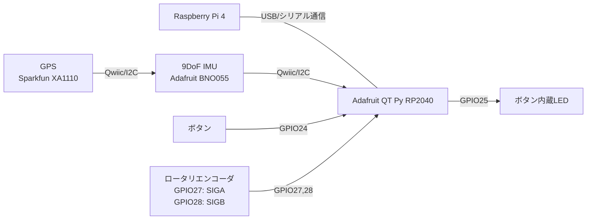
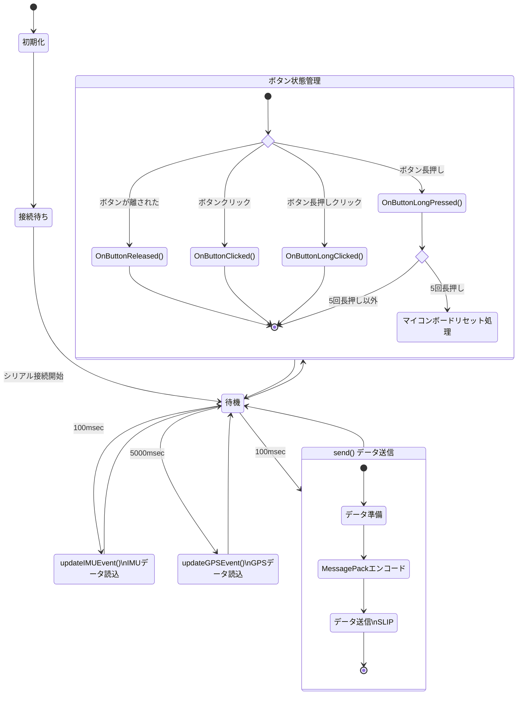
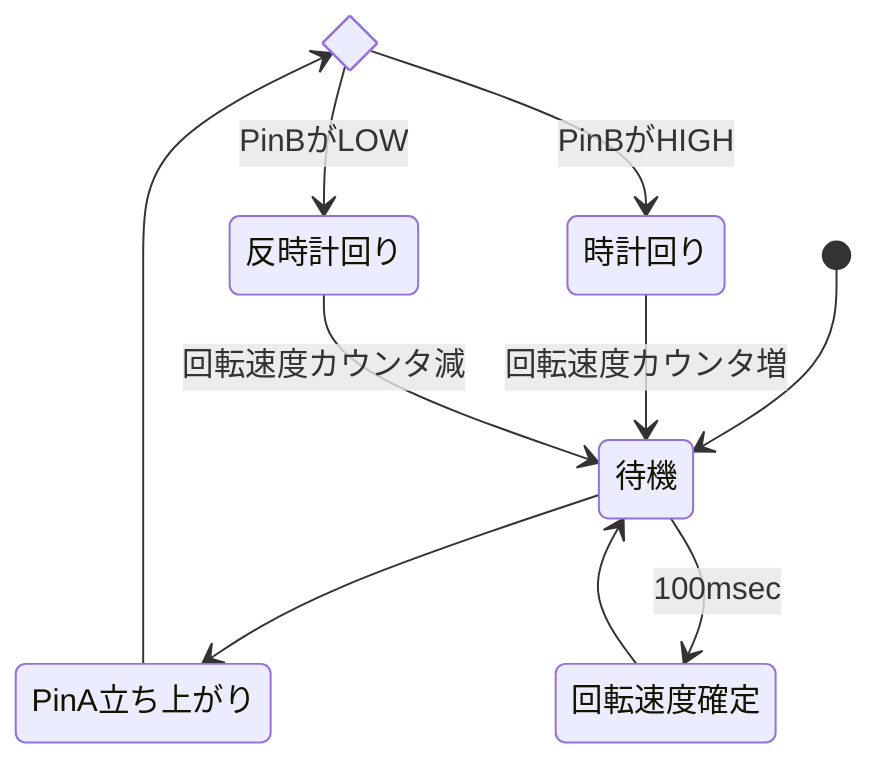

# センサ制御用プログラム

## ファイル

- controller.ino : メインプログラム
- controller.h : メインプログラムのヘッダー

## ハードウェア

- マイコンボード: Adafruit QT Py RP2040
- 慣性計測ユニット(IMU) : Adafruit BNO055
- GPS: Sparkfun XA1110
- LED ランプ内蔵型スイッチ
- ロータリエンコーダ: Pololu ペアホイール 42 x 19 mm 用エンコーダ

### 接続図



## ビルド

### (1)Arduino IDE の準備

1. ファイル → 環境設定 → ボードマネージャに追加

https://github.com/earlephilhower/arduino-pico/releases/download/global/package_rp2040_index.json

1. ボード →Raspberry Pi RP2040 Boards→Adafruit QT Py RP2040 を選択

1. シリアルポートを選ぶ

### (2)使用ライブラリ

ビルドするには、Arduino IDE のライブラリマネージャから下記ライブラリをインストールしておく。

- SparkFun_I2C_GPS_Arduino_Library : GPS
  - TinyGPS++ : GPS の NMEA フォーマットのパーサー
- Adafruit_BNO055 : 9DoF IMU(慣性計測ユニット)
  - Adafruit_BusIO
  - Adafruit_Unified_Sensor
- Adafruit_NeoPixel : QT Py RP2040 に搭載されている LED(動作確認用)
- ardukit : タイマー処理
- MsgPack : シリアル通信のデータ形式(MessagePack)
- PacketSerial : シリアル通信(SLIP)
- EventButton : ボタンイベント

### (3)ビルド

Adafruit QT Py RP2040 を PC に接続し、プログラムをマイコンボードに書き込む。

## データ形式

### 送信データフォーマット

MessagePack 形式
ホストとの通信は SLIP でエンコード後、シリアル通信で送信

```json
{
    hasImu: bool IMUが利用可能か
    hasGps: bool GPSが利用可能か
    eulerAngle: { オイラー角
        heading: float 
        pitch: float 
        roll: float 
    }
    accel: {
        x, y, z: float 加速度センサー
    }
    gyro: {
        x, y, z: float ジャイロセンサー
    }
    mag: {
        x, y, z: float 磁気センサー
    }
    button: {
        event: イベント状態
        count: ボタンを押した回数
    }
    wheel: int wheelの回転量（大きいほど早く回している。プラス：時計回り？、マイナス：反時計回り？、0：停止）
}
```

キー無しだと以下のようなデータ構造で送信される。
```
[true,true,[0,0,0],[0,0,0],[0,0,0],[0,0,0],[0,0],[0,0],0]
```


## 処理内容について

RP2040 は 2core なので、各コアに処理を振り分けている。ロータリエンコーダの処理はエッジ検出の取りこぼしがないように 1 コアを占有し、それ以外はもう 1 コアで処理を行う。

- core #0
  - IMU
  - GPS
  - Button/LED
  - データ送信
- core #1
  - Wheel(ロータリエンコーダ)

CPU core #0



CPU core #1


